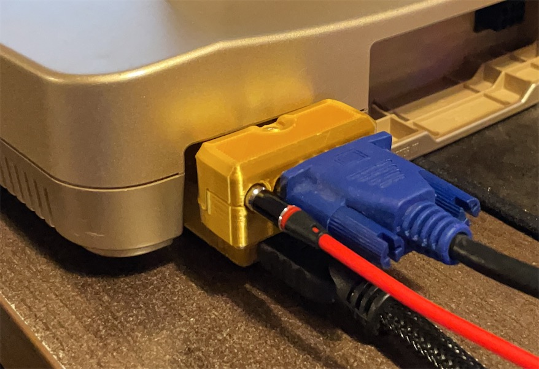
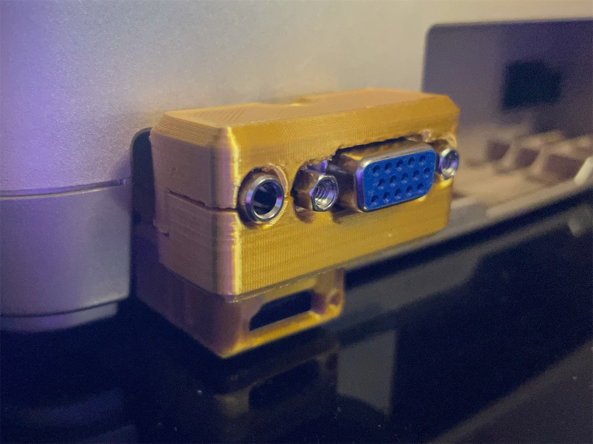
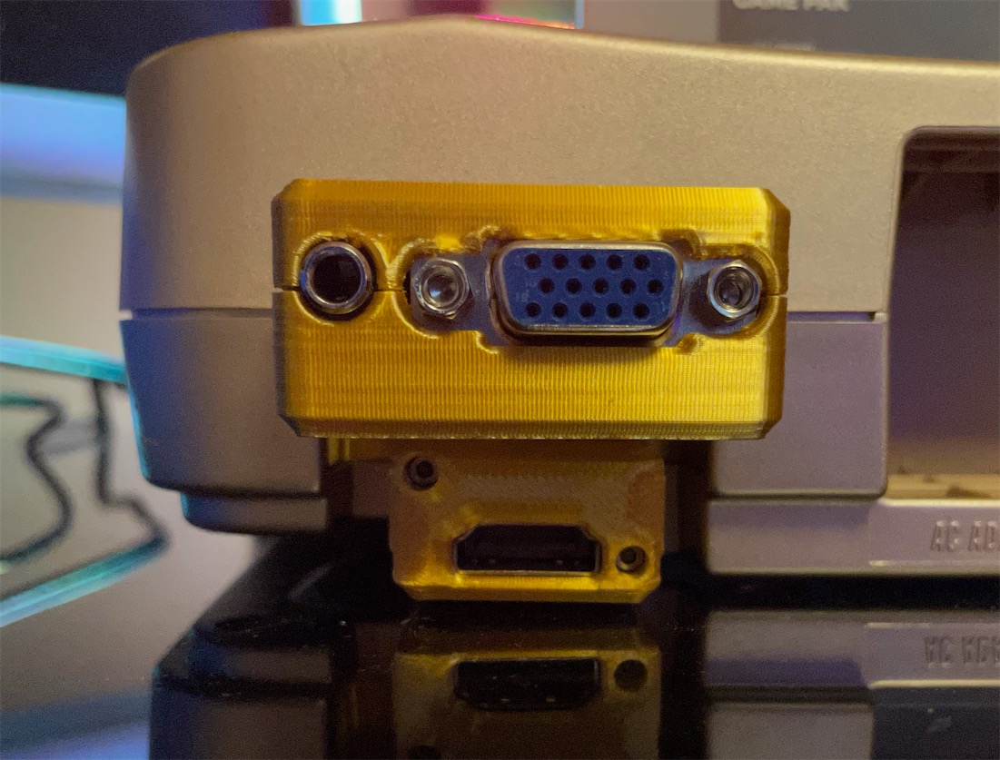
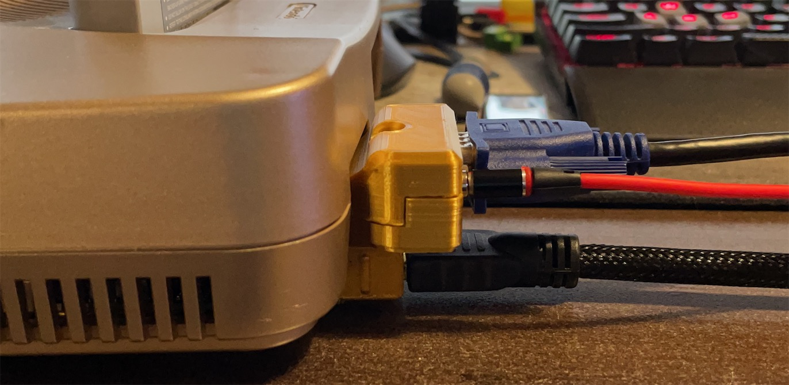
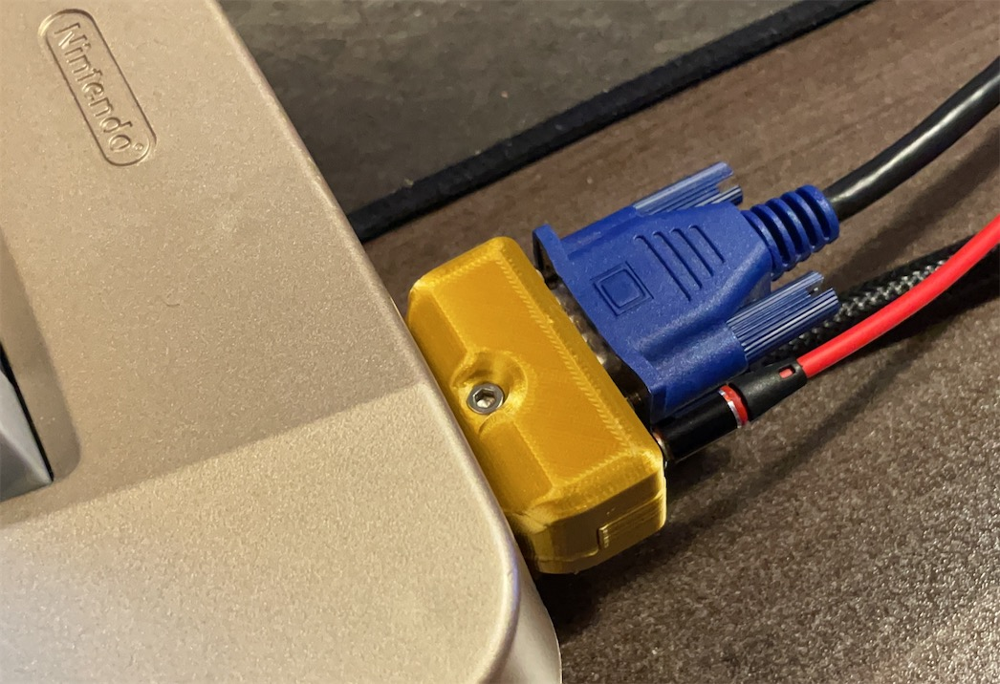
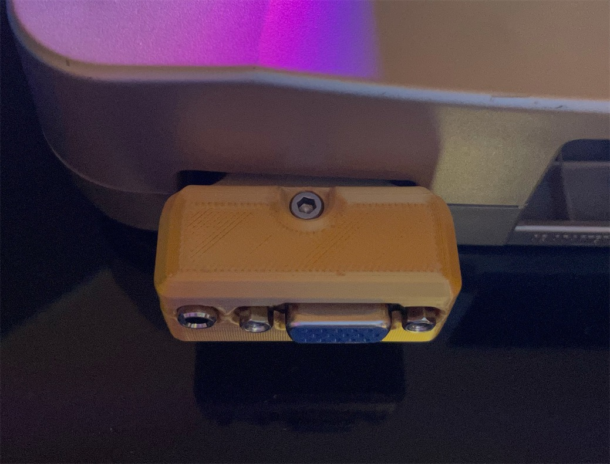
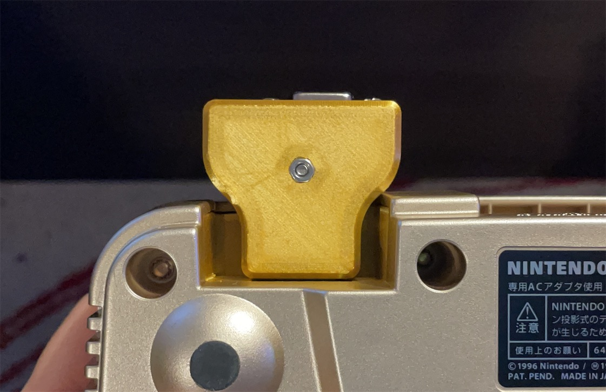
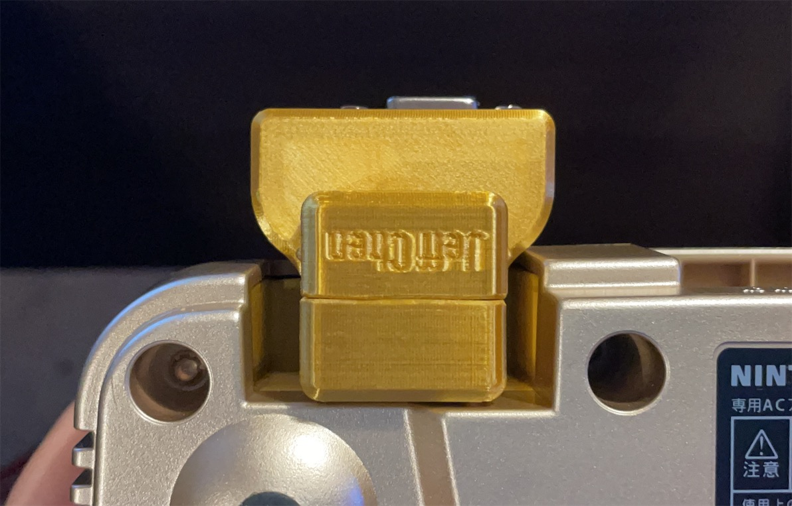

# N64D2VGA

N64D2VGA Dongle for Nintendo 64 Console.

## Introduction

This dongle takes the RGBS signal from the AV Multi output on a Nintendo 64 console and adapts it into HD15 (VGA), so you can use the commonly available VGA cable for transmitting RGBs video and stereo audio.

This is designed to work with the [N64Digital mini HDMI to Full HDMI Dongle](https://github.com/jeffqchen/N64Digital-Mini-To-Full-HDMI-Adapter). You could achieve analogue & digital dual output with full sized plugs without interference.

Note that the Nintendo 64 requires a mod in order to output RGBS signal, such as:

- [N64Digital](https://docs.pixelfx.co/N64Digital-Details.html)
- Simple RGB mod ([Voultar's](https://voultar.com/index.php?route=product/product&product_id=50&tracking=5824d766cf098), [Borti's](https://github.com/borti4938/n64rgb/tree/master/simpleRGBamp))
- [N64RGB](https://github.com/borti4938/n64rgb)

### Sync

You can choose among CSync, Luma and composite video as your sync signal with the jumper on the PCB.

Note PAL console does not support CSync and you should not populate CSync related components.

### Audio

Audio can be sent within the VGA cable, or broken out from the 3.5mm jack on the dongle. Buzzing may be noticeable when audio is transmitted through the VGA cable in certain scenes in certain games. This is due to insufficient shielding in most VGA cables. If you find the buzzing to be annoying, please use the 3.5mm jack on the dongle for audio outputting. This will ensure the cleanest audio output.

-----

## Parts

### Common Parts

PCB
  - Main https://oshpark.com/shared_projects/gnmrDMrM
  - Sub https://oshpark.com/shared_projects/ERxGMR9J

Nintendo AV Multi Plug
- https://www.aliexpress.com/item/4000049107078.html

VGA Port Female - Slim
- https://www.aliexpress.com/item/4000596805684.html

PJ-325 3.5mm Audio Jack - 5 contacts, vertical design
- https://www.aliexpress.com/item/1005002983859846.html
- https://www.digikey.com/en/products/detail/cui-devices/SJ1-3535N/738696

[2x] 0603 Capacitor 6.3V 10uF - C4, C5

M3x20mm screw and nut
- https://www.amazon.com/gp/product/B014OO5KQG

3D Printed Shell - Top & Bottom

---

### NTSC Configuration

- [1x] 0603 Resistor 470 Ohm - R1, **ONLY** if you choose CSync
- [3x] SMD electrolytic Capacitor 220uF - C1, C2, C3

---

### PAL Configuration

- [4x] 0603 Resistor 75 Ohm - R2, R3, R4, R5

---

## Assembly

Please refer to the [SNES2VGA assembly guide](https://github.com/jeffqchen/SNES2VGA#printing-the-shell), as they are very similar.

---

## Special Thanks

Mike Chi - Beloved creator of RetroTink
- https://www.retrotink.com
