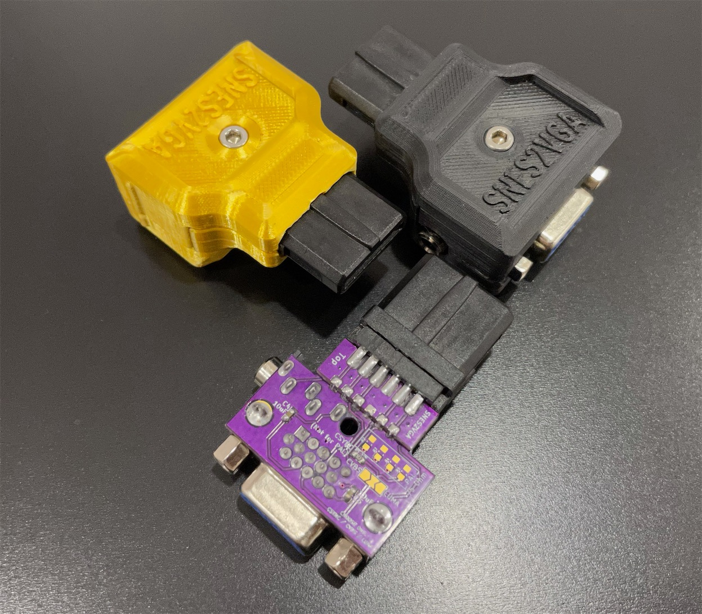
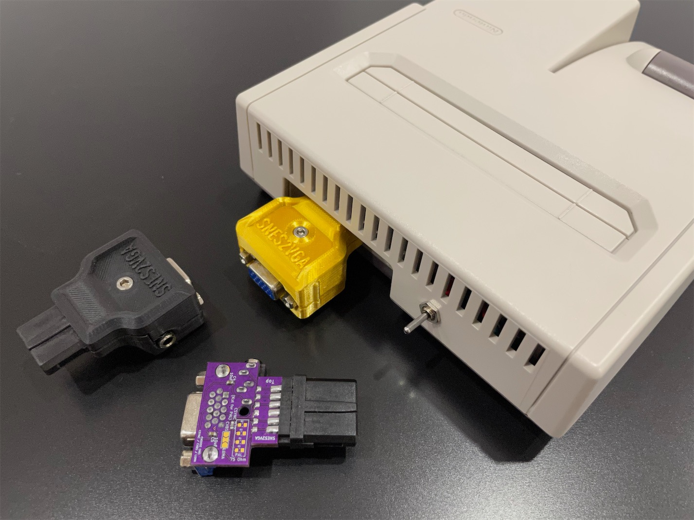
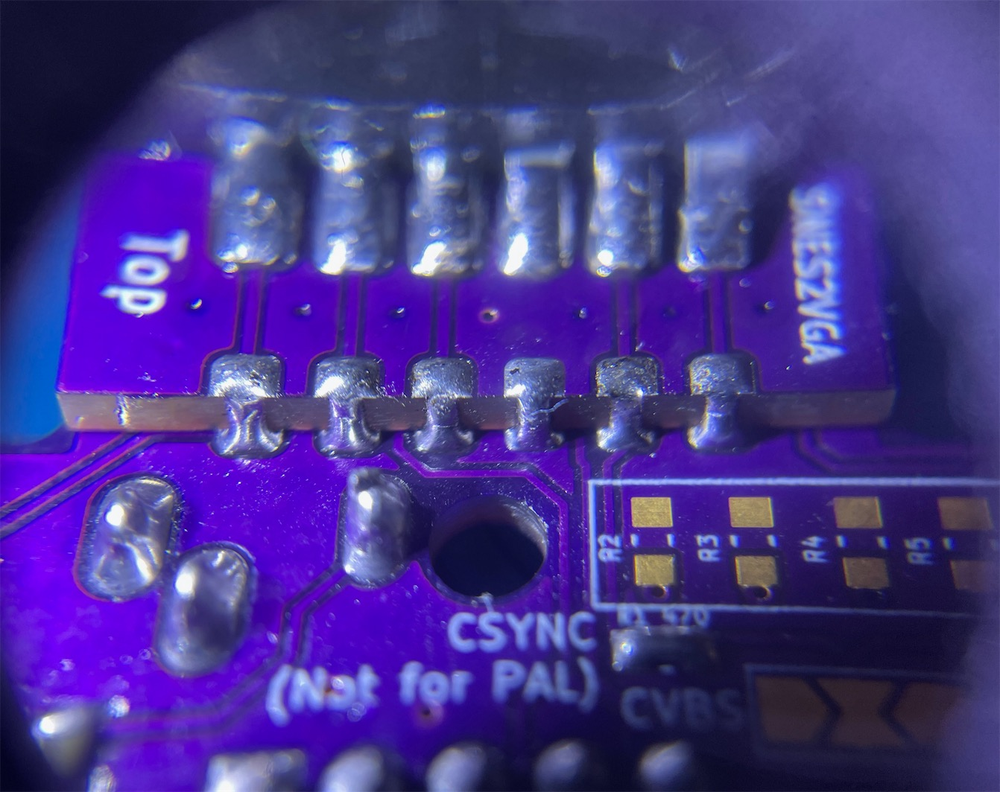
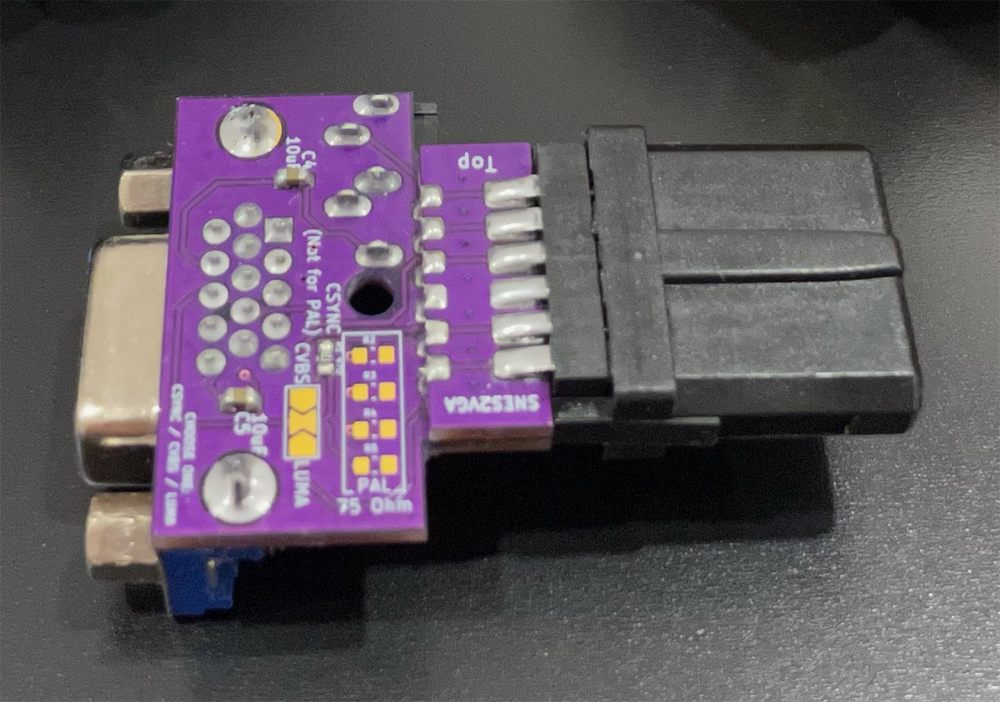

# SNES2VGA

SNES2VGA Dongle for Nintendo Consoles

## Introduction

This dongle takes the AV Multi output used on various Nintendo consoles and adapts them into HD15 (VGA), so you can use the commonly available VGA cable for transmitting RGBs video and stereo audio.

Note that consoles usually require RGB mods in order to output RGBs signal.

- NES/Famicom - NESRGB with AV Multi output
- SNES - As-is, or RGB Bypass for better video quality
- Nintendo64 - Simple RGB mod, N64RGB, N64Digital
- GameCube - GCDual

 
 

### Audio

Audio can be sent within the VGA cable, or broken out from the 3.5mm jack on the dongle. Buzzing may be noticeable when audio is transmited throught the VGA cable in certain scenes in certain games. This is due to insufficient shielding in most VGA cables. If you find the buzzing to be annoying, please use the 3.5mm jack on the dongle for audio outputting. This will ensure the cleanest audio output.

### Variation

A specific version called [N64D2VGA](./N64D2VGA) that works with Nintendo 64 is also provided.

This one works well with my [N64Digital mini HDMI to Full HDMI Dongle](../../../N64Digital-Mini-To-Full-HDMI-Adapter) so you could achieve analogue & digital dual output with full sized plugs without interference.

-----

## Parts

### Common Parts

PCB
  - Main https://oshpark.com/shared_projects/nDvZOKmn
  - Sub https://oshpark.com/shared_projects/RpSdS3qo

Nintendo AV Multi Plug
- https://www.aliexpress.com/item/4000049107078.html

VGA Port Female - Slim
- https://www.aliexpress.com/item/4000596805684.html

PJ-325 3.5mm Audio Jack - 5 contacts, vertical design
- https://www.aliexpress.com/item/1005002983859846.html
- https://www.digikey.com/en/products/detail/cui-devices/SJ1-3535N/738696

[2x] 0603 Capacitor 6.3V 10uF - C4, C5

M3x20mm screw and nut
- https://www.amazon.com/gp/product/B014OO5KQG

3D Printed Shell - Top & Bottom

---

### NTSC Configuration

- [1x] 0603 Resistor 470 Ohm - R1, **ONLY** if you choose CSync
- [3x] 1206 Capacitor X5R 6.3V 100 ~ 220uF - C1, C2, C3

The suggested value for the capacitor is 220uF or above. Using 100uF caps will give you non-uniform brightness vertically. It won't show on a CRT screen but you might be able to spot it with a scaler. But, the 100uF caps are much cheaper and verified to work, so it's your choice to make.

---

### PAL Configuration

- [4x] 0603 Resistor 75 Ohm - R2, R3, R4, R5

---

## Printing the shell

Print the files with the split face facing downwards.

Print with support.

For a better mating surface finishing, use raft for bed adhesion.

---

## PCB Assembly

### Solder sub PCB to the main

First, align the sub PCB on top of the main PCB, align with the helper line and make sure the correct sides are facing the outside. Solder the two outside-most castellated pins and pads one by one, making sure the outside of the two boards are flush, so the plug can be soldered properlly. Then proceed to solder the rest of the castellated pins to the pads.

### Solder on the video plug

Next, take a Nintendo video plug. Note the pins on the soldering side are sticking out straight. Now **bend** both rows of the pins inwards, with the help of the edge of a table. This way, the pins will actually be able to touch the pads on the PCB compound.

Tuck the plug onto the coumpound PCB. Make sure the plug is pointing the correct way up - the notched side of the plug is up, and the side with the smaller sub PCB is up. Align the pins to the pads as good as possible. Make sure there is no gap between the plug and the PCB on the mating edge. Then, solder one pin on each side with a generous amount of solder. Remelt and adjust the position if needed. Then proceed and solder the rest of the pins to the PCB with generous amount of solder.

### SMD components

Solder on the SMD components. Note for NTSC and PAL consoles, the component configurations are **different**. Please obey the instructions on the silk screen.

---

### NTSC Configuraion

- Populate C1, C2, C3

Choose Sync among CSync, Composite (CVBS) or Luma
- Populate R1, OR short jumper J1 for CVBS or Luma. Choose only **ONE**.

---

### PAL Configuration

- **DO NOT** populate R1.
- Populate R2, R3, R4, R5.
- Short C1, C2, C3 with individual conductors.

Choose Sync between Composite (CVBS) or Luma

- Short jumper J1 for CVBS or Luma. Choose only **ONE**.

---

### Through hole components

Solder on the through hole VGA and 3.5mm audio port. Note they are supposed to be on the bottom side of the PCB. Pay attention to the silk screen markings.

---

## Final Assembly

Tuck the assembled PCB into one side of the shell. Make sure the video plug fits correctly in. Then drop the other side of the shell in and slowly bring the two sides to a close. Inspect the shells for any remaining support material if you can't correctly close it up. Finally, put in the screw and nut to secure the whole assembly.

---

## Special Thanks

Mike Chi - Beloved createor of RetroTink
- https://www.retrotink.com

Javier Rodas
- https://twitter.com/JaviRodasG
